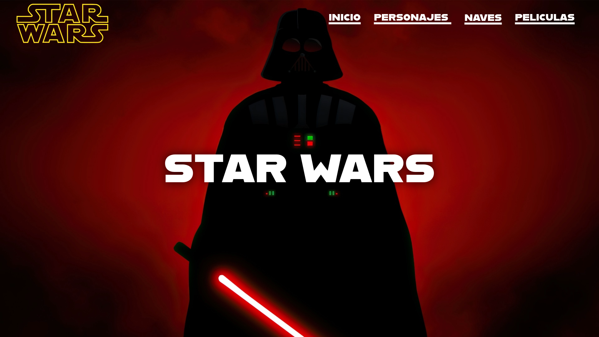

# Star Wars Fan Page

Bienvenido a la Fan Page de Star Wars, un proyecto dedicado a los fanáticos de esta increíble saga. Aquí podrás explorar información sobre los personajes, naves y películas, además de disfrutar de una página de inicio interactiva.

## Características del Proyecto

- **Página de Inicio**: Una introducción interactiva al mundo de Star Wars.
- **Personajes**: Información detallada sobre los personajes más icónicos de la saga.
- **Naves**: Descubre las naves espaciales que han marcado la historia de Star Wars.
- **Películas**: Explora las películas que conforman esta épica franquicia.

## Tecnologías Utilizadas

- HTML
- CSS
- JavaScript

## Maquetación y Diseño

El diseño de la Fan Page de Star Wars se centra en ofrecer una experiencia visual atractiva y fácil de navegar para los usuarios. A continuación, se describen los aspectos clave de la maquetación y diseño:

- **Diseño Responsivo**: La página está optimizada para adaptarse a diferentes tamaños de pantalla, incluyendo dispositivos móviles, tablets y computadoras de escritorio.
- **Paleta de Colores**: Se utiliza una paleta de colores inspirada en el universo de Star Wars, con tonos oscuros y detalles en colores brillantes como rojo y azul.
- **Tipografía**: Fuentes estilizadas que evocan el estilo futurista de la saga.
- **Estructura Modular**: Cada sección (inicio, personajes, naves y películas) está organizada en módulos independientes para facilitar la navegación.
- **Imágenes e Íconos**: Uso de imágenes de alta calidad y íconos personalizados para enriquecer la experiencia visual.

La maquetación se realiza utilizando **HTML** y **CSS**, mientras que **JavaScript** se emplea para agregar interactividad y dinamismo al sitio.

### Home


### Home - 2


### Home - 3


### Personajes


### Naves


### Nave info


### Movies


## Estructura del Proyecto

Star_Wars/
├── index.html          
├── css/
│   ├── styles.css     
├── js/
│   ├── scripts.js      
├── assets/
│   ├── images/         
│   ├── icons/         
├── pages/
│   ├── characters.html 
│   ├── ships.html      
│   ├── movies.html     
├── README.md           

## Cómo Ejecutar el Proyecto

1. Clona este repositorio:
   ```bash
   git clone <URL-del-repositorio>

2. Navega a la carpeta del proyecto
   ```bash
   cd Star_Wars

3. Abre el archivo index.html en tu navegador para visualizar la página principal.

4. Opcionalmente, puedes utilizar un servidor local para ejecutar el proyecto. Por ejemplo, con Python:
   ```bash
   python3 -m http.server


