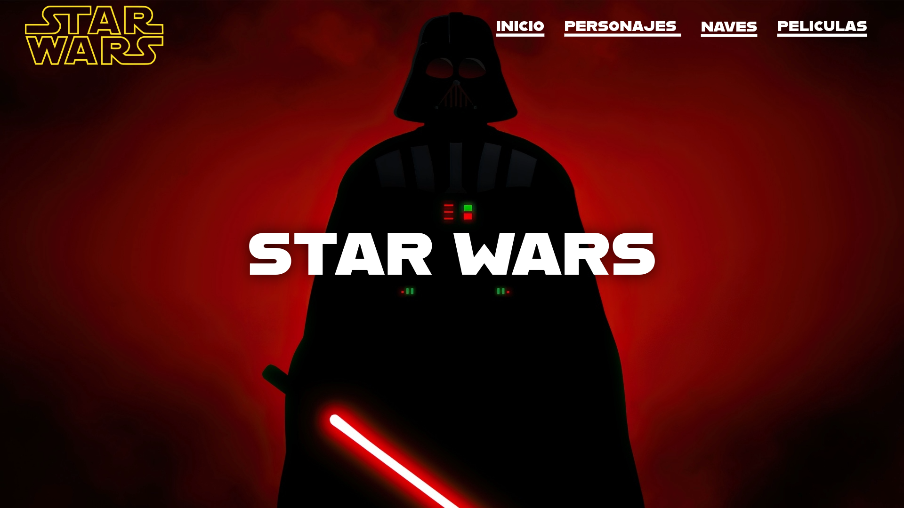

# ⭐ Star Wars Fan Page — *Explora la Galaxia como Nunca Antes*

¡Bienvenido al universo de Star Wars! Esta fan page es un homenaje interactivo y visualmente atractivo a la saga más épica de la historia del cine. 🌌

Aquí podrás descubrir personajes, naves y películas, con vistas detalladas, información dinámica desde APIs, filtros inteligentes, y una experiencia optimizada tanto para escritorio como para dispositivos móviles.

---

## 🚀 Características

✅ **Exploración de personajes**  
Visualiza una galería completa con descripciones, imágenes, afiliaciones y películas donde aparece cada personaje.

✅ **Catálogo de naves**  
Desde el icónico Millennium Falcon hasta el TIE Fighter. Cada nave cuenta con imagen, estadísticas, descripción y referencias cinematográficas.

✅ **Base de datos de películas**  
Navega por la cronología oficial, obtén detalles de cada episodio y su contenido visual.

✅ **Filtros y búsqueda en tiempo real**  
Filtra personajes y naves por película o búscalos por nombre. Rápido, eficiente y fluido.

✅ **Integración con API externa**  
El sistema consulta primero la API oficial de Star Wars y, si no obtiene resultados, usa una base de datos local de respaldo.

✅ **Responsive Design 100%**  
Diseño adaptable para computadoras, tablets y smartphones, con estilos inspirados en Star Wars (fuentes galácticas, botones temáticos y colores cinematográficos).

✅ **Componentes personalizados**  
Uso de etiquetas personalizadas como `<characters-sw>` y `<ships-sw>` para una arquitectura más limpia y mantenible.

---

## 📁 Estructura del proyecto

```
├── index.html
├── HTML/
│ ├── Characters_SW.html
│ ├── Ships_page.html
│ ├── movies_page.html
│ └── ship_info.html
├── CSS/
│ └── design.css
├── JavaScript/
│ ├── characters.js
│ ├── ships.js
│ └── movies.js
├── JSON/
│ ├── characters.json
│ ├── ships.json
│ └── movies.json
├── icons/
│ └── [iconos de Star Wars]
├── photos/
│ └── [imágenes de personajes y naves]
└── README.md
```

## Maquetación y Diseño

El diseño de la Fan Page de Star Wars se centra en ofrecer una experiencia visual atractiva y fácil de navegar para los usuarios. A continuación, se describen los aspectos clave de la maquetación y diseño:

- **Diseño Responsivo**: La página está optimizada para adaptarse a diferentes tamaños de pantalla, incluyendo dispositivos móviles, tablets y computadoras de escritorio.
- **Paleta de Colores**: Se utiliza una paleta de colores inspirada en el universo de Star Wars, con tonos oscuros y detalles en colores brillantes como rojo y azul.
- **Tipografía**: Fuentes estilizadas que evocan el estilo futurista de la saga.
- **Estructura Modular**: Cada sección (inicio, personajes, naves y películas) está organizada en módulos independientes para facilitar la navegación.
- **Imágenes e Íconos**: Uso de imágenes de alta calidad y íconos personalizados para enriquecer la experiencia visual.

La maquetación se realiza utilizando **HTML** y **CSS**, mientras que **JavaScript** se emplea para agregar interactividad y dinamismo al sitio.

### Home


### Home - 2


### Home - 3


### Personajes


### Personajes info


### Naves


### Nave info


### Movies


### Movies info


## 🔧 Tecnologías utilizadas

- HTML5 + CSS3 + JavaScript
- Componentes Web (etiquetas personalizadas)
- Fetch API + manejo de errores
- JSON estructurado (personajes, naves, películas)
- Responsive Design 
- Fuentes temáticas de Star Wars

---

## ✨ ¿Qué sigue?

- [ ] Sistema de favoritos con LocalStorage
- [ ] Reproductor musical con temas icónicos
- [ ] Animaciones de entrada con Framer Motion (o CSS puro)
- [ ] Sistema multilenguaje

---

## 🙌 Créditos

Proyecto desarrollado por Joan Gomez y Sergio Lievano como un homenaje y práctica profesional del desarrollo web moderno.

🔗 Fuentes de datos: [SWAPI.dev](https://swapi.dev)  
🎨 Diseño visual inspirado en el universo de Star Wars

---

## 💫 Que la Fuerza te acompañe

> “Tu enfoque determina tu realidad.” — *Qui-Gon Jinn*


